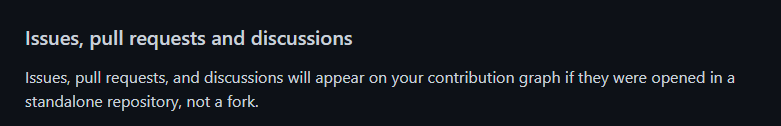

# xmaxsweeper-opengl
ХмахСвипер на OpenGL

*Github почему-то не трекает изменения в этом репозитории*

**P.S**

## Условия состязания

- Использовать только язык C (c11)

- Использовать OpenGL 3.x+, GLFW, CGLM, GL3W

- Использовать только процедурную графику (никаких готовых текстур и моделей)

- Разрабатываем до 16.11.2022 до 23:59 по МСК
