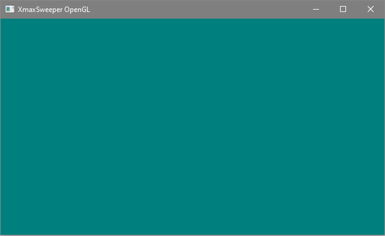

# xmaxsweeper-opengl
ХмахСвипер или какой-нибудь другой Сапёр (какой получится) на OpenGL

## Условия состязания

- Использовать только язык C (c11)

- Использовать OpenGL 3.x+, GLFW, CGLM, GL3W

- Использовать только процедурную графику (никаких готовых текстур и моделей)

- Разрабатываем до 16.11.2022 до 23:59 по МСК

- Состязание продлено до 30.11.2022

## Активность

**06.11.2022**

**07.11.2022**

## Почему я по активности ничё не делаю?

*У тебя в Github нулевая активность, ты вообще что-нибудь делаешь?*

Да, просто Github не трекает активность на форках

